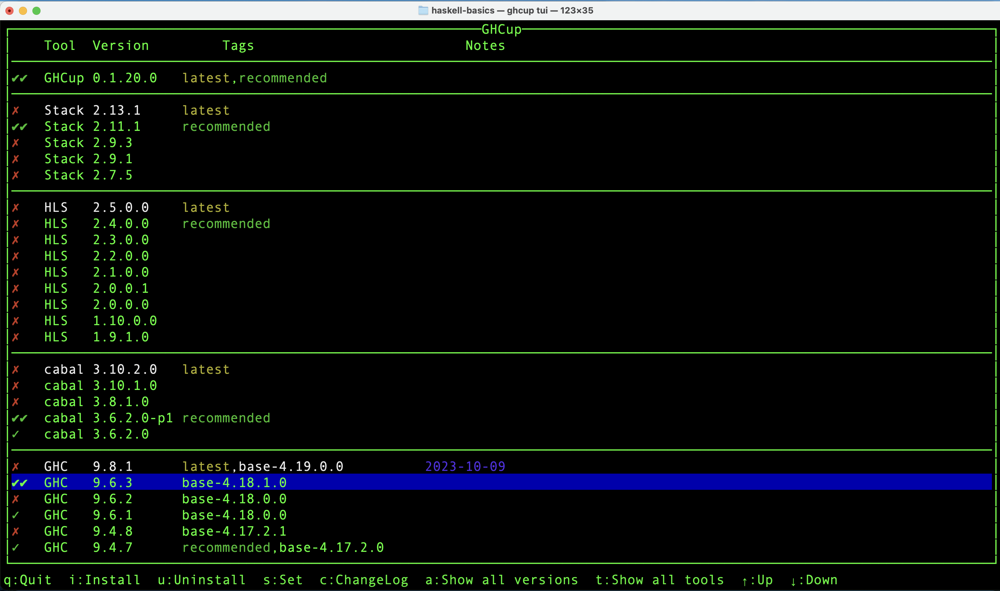

# haskell-basics
Talk: Intro to Haskell, for Jax.Ex

## Description
This application currently reproduces with haskell the behavior of -t flag of the column linux utility: `column -t`.

## Installation
To install on Linux, macOS, FreeBSD or WSL2
```bash 
{
  curl --proto '=https' --tlsv1.2 -sSf https://get-ghcup.haskell.org | sh;
  source ~/.bashrc; `# if you installed to bashrc`
  ghcup tui; 
  `# use i to install and s to set`
}
```

#### Your ghcup tui should look like the following (only the double green checkmarks are important)



## Installation Tips:
```bash
# Check your version of ghcup
ghcup tui

# if you opened the repl ghci use :quit to exit

```

## Running the program

#### convert a license to a column format
```
cabal run < LICENSE
```

#### get only files from /etc ... but leave them in a column format
```
ls -p /etc | grep -v / | tr '\n' '\t' | fold -s > tmp; cabal run < tmp; rm tmp
```

#### compare to `column -t` - which sometimes gives a column: line too long error.
```
ls -p /etc | grep -v / | tr '\n' '\t' | fold -s > tmp; column -t < tmp; rm tmp
```

## Slides
more useful links and information can be found in the presentation here: [slides](/doc/slides.md)

